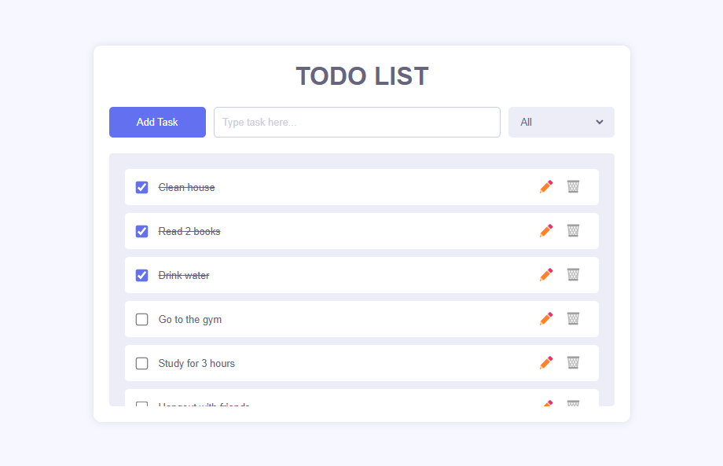

# Simple To-do

<div style="width: 100%; text-align: center; align-items: center">
    
</div>

## Description
This is repo contains the frontend and backend code for a to-do website. The tools used were: PostgreSQL, ExpressJS, React and NodeJS.

## Requirements
To run this project, you will need [Node.js](https://nodejs.org/), [NPM](https://www.npmjs.com/) and [PostgreSQL](https://www.postgresql.org/) installed in your environment.

## Installation
- Clone the repository
```
$ git clone https://github.com/bernardoarodrigues/SimpleTodo
```

- Create a PostgreSQL database
```
$ psql -U user_name
postgres=# CREATE DATABASE database_name;
```

- Create a .env file in `SimpleTodo/server` with your PostgreSQL information:
```
USER="user_name"
PASSWORD="user_password"
DATABASEPORT=port (default is 5432)
DATABASE="database_name"
```

- Install backend dependencies and run the project

```
$ cd SimpleTodo/server
$ npm install
$ npm start
```

- Install frontend dependencies and run the project
```
$ cd SimpleTodo/client
$ npm install
$ npm start
```